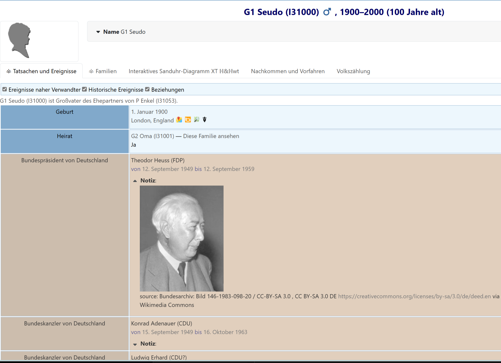

# webtrees module german-chancellors-presidents

This [webtrees](https://www.webtrees.net) module provides historical facts about the Chancellors and Presidents of Germany (since 1949).
The admin can select if data from a csv file is presented or data from wikidata. Using wikidata is still "beta", but several advantages are already available.
There is an additional query (besides Chancellors and Presidents): state heads of former GDR. Other countries may be added in the future.
When using the csv all links to the persons are linked to the German Wikipedia.
When using the wikidata option, everything is personalized to the user's language, including the links to "his" wikipedia.
At the moment photos are only shown in the csv option, not in the wikidata option.

## Screenshot

## Usage

The structure of historical events provided by this module is oriented on GEDCOM events (EVEN).
     
  *      1 EVEN <name> (<party>)
  *      2 TYPE <Chancellor|President> of Germany
  *      2 DATE <date period>
  *      2 NOTE [wikipedia de](<link>) or format including an image (using Markdown)
  *      3 CONT <image attribution>   

The basic information is stored as csv file in the folder resources and can be edited easily.
The comma-separated columns in that file are
  *      name (party)
  *      type (C|P) and subtype (A) (using C|P|A for Chancellor|President|acting
  *      acting time range (using format of GEDCOM date range)
  *      wikipedia article (name of article in (German) wikipedia)
  *      image link (URL based on wikicommons (without leading https://)
  *      image attribution (from Wikipedia Commons image licence)

At the moment only the German wikipedia is supported.

For wikipedia links in the notes Markdown formatting is used;
this should be enabled for your tree. See Control panel/Manage family trees/Preferences and then scroll down to "Text" and mark the option "markdown".
If markdown is disabled the links are still working, but the formatting isn't so nice.

Select as user "Historic events" at the "Facts and events" tab.

As an administrator, you can modify how the historical events are presented in the timeline of a person by using the CSS&JS module
(see the [German webtrees manual](https://wiki.genealogy.net/Webtrees_Handbuch/Entwicklungsumgebung#Beispiel_-_Farben_bei_Historischen_Fakten_anpassen)).

## webtrees

**[webtrees](https://webtrees.net/)** is an online collaborative genealogy application.
This can be hosted on your own server by following the [Install instructions](https://webtrees.net/install/).
If you are familiar with Docker, you might like to install **webtrees** using [this unofficial docker image](https://hub.docker.com/r/nathanvaughn/webtrees), or any other one.

## Requirements

This module requires **webtrees** version 2.0 or later.
This module has the same requirements as [webtrees#system-requirements](https://github.com/fisharebest/webtrees#system-requirements).

This module was tested with **webtrees** version 2.1.21 and 2.2.1.
All available themes and all other custom modules can be used together with this one.

## Installation

This section documents installation instructions for this module.

1. Download the [latest release](https://github.com/hartenthaler/german-chancellors-presidents/releases/latest)
1. Unzip the package into the `webtrees/modules_v4` directory of your web server
1. Rename the folder to `german-chancellors-presidents`

## Upgrade

To update simply replace the `german-chancellors-presidents` files
with the new ones from the latest release.

## Translation

When using the csv option only the event types (chancellor, president) can be translated.

You can use a local editor,
like Poedit or Notepad++, to make the translations for this module and send them back to me.
You can do this via a pull request (if you know how) or by e-mail.

Discussion on translation can be done by creating an [issue](https://github.com/hartenthaler/german-chancellors-presidents/issues).

Updated translations will be included in the next release of this module.

There are now, besides English and German, no other translations available.

## Support

**Issues**: for any ideas you have, or when finding a bug you can raise an [issue](https://github.com/hartenthaler/german-chancellors-presidents/issues).

**Forum**: general webtrees support can be found at the [webtrees forum](http://www.webtrees.net/).

## Adding new data, Programming and Testing

If you'd like to contribute to this module, great! You can contribute by

- Contributing historical facts: make you familiar with the structure of the csv file; change existing or add new data; test it; [create an issue](https://github.com/hartenthaler/german-chancellors-presidents/issues), then you can link your pull request.
- Contributing code: check out the issues for things that need attention. If you have changes you want to make not listed in an [issue](https://github.com/hartenthaler/german-chancellors-presidents/issues), please create one, and then you can link your pull request.
- Testing: it's all manual currently, please [create an issue](https://github.com/hartenthaler/german-chancellors-presidents/issues) for any bugs you find.

How to get the information for an image link and attribution:
- go to the wikipedia article
- click on an image
- ask for details
- select "use this file"
- copy File URL and Attribution
- transfer this information into the csv file (replacing all commas in the attribution by other characters or enclosing in "...".)

## License

* Copyright (C) 2025 Hermann Hartenthaler
* Derived from **webtrees** - Copyright 2025 webtrees development team.

This program is free software: you can redistribute it and/or modify
it under the terms of the GNU General Public License as published by
the Free Software Foundation, either version 3 of the License, or
(at your option) any later version.

This program is distributed in the hope that it will be useful,
but WITHOUT ANY WARRANTY; without even the implied warranty of
MERCHANTABILITY or FITNESS FOR A PARTICULAR PURPOSE. See the
GNU General Public License for more details.

You should have received a copy of the GNU General Public License
along with this program. If not, see <http://www.gnu.org/licenses/>.

* * *
